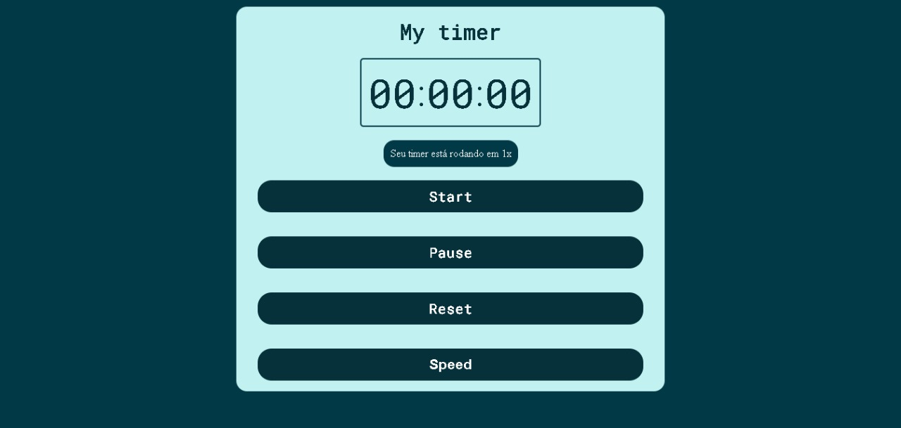

<h1 align="center">
    
     
    Timer for Udemy course project!
     
</h1>

  

  

  
  

  

  

  

## :rocket: Technologies

This project was developed with the following technologies:

- [Javascript](https://www.w3schools.com/js/DEFAULT.asp)
- [CSS](https://www.w3schools.com/css/)
- [HTML](https://www.w3schools.com/html/)
